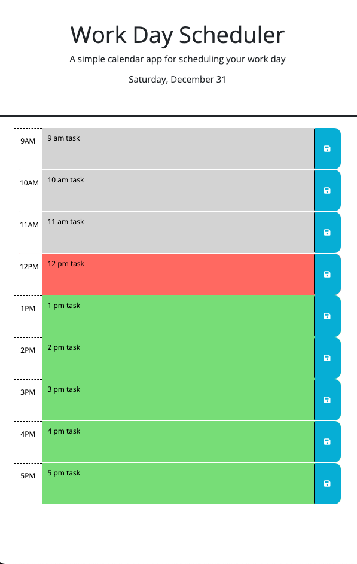
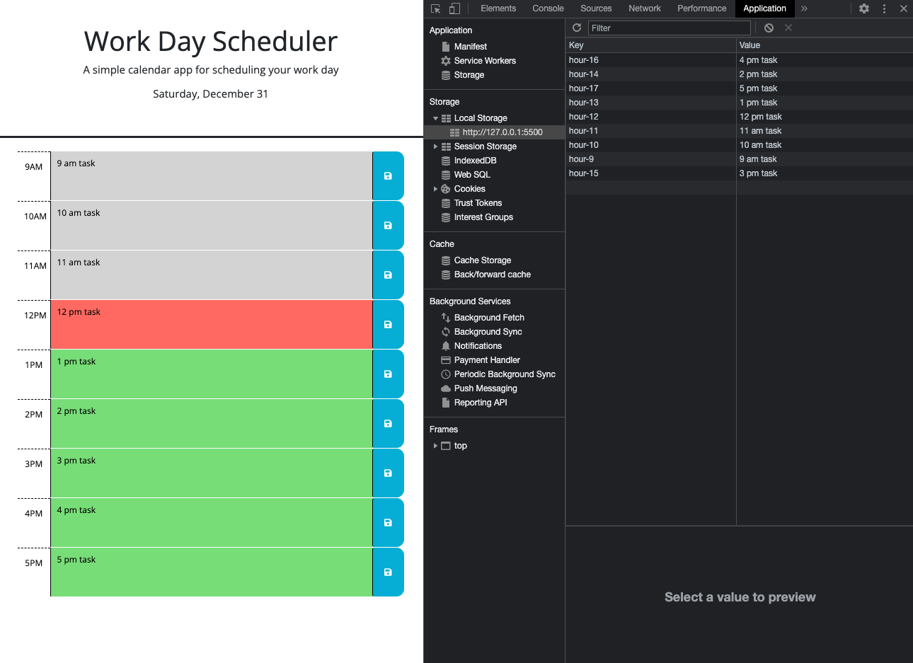

# Daily Planner App

## Project Scope

This daily planner application helps users to organize their workday by entering and saving daily tasks and tracking progress throughout the day.

---

## Functionality 

The following criteria include app functions: 

- The calendar allows users to save tasks for each hour of the day
- The app includes standard working hours from 9 am to 5 pm
- The app utilizes the Day.js library to update date and time features dynamically
- The calendar displays the current day (weekday and date) at the top of the page
- The time blocks are organized into 1-hour segments 
- Each time block is color-coded to indicate whether it is in the past, present, or future 
  - Gray is for the past, red is for the present, green is for the future
- When users click on time blocks, they can enter tasks and save them 
- The app utilizes local storage to save tasks 
- When the page is refreshed, the saved tasks continue to appear on the calendar

(<a href="#daily-planner-app">back to top</a>)

---

## Demo 

This mock-up demonstrates the user interface of the app.

(<a href="#daily-planner-app">back to top</a>)

---

This mock-up demonstrates the local storage functionality, which enables users to save tasks and ensures the saved tasks persist after refreshing the page. 

(<a href="#daily-planner-app">back to top</a>)

---

## Application link

[Check out the Daily Planner App here!](https://veronika-pomy.github.io/Daily-Planner-App/)

(<a href="#daily-planner-app">back to top</a>)

---

## License

Distributed under the MIT License. See `LICENSE.txt` for more information.

(<a href="#daily-planner-app">back to top</a>)

---

## Acknowledgments 

This list includes resources used for the project. 

- [Best README Template](https://github.com/othneildrew/Best-README-Template/blob/master/README.md)
- [Day.js Library](https://day.js.org/)
- [Day.js Library Advanced Format Plug-in](https://day.js.org/docs/en/plugin/advanced-format)
- [jQuery Library](https://jquery.com/)

(<a href="#daily-planner-app">back to top</a>)
